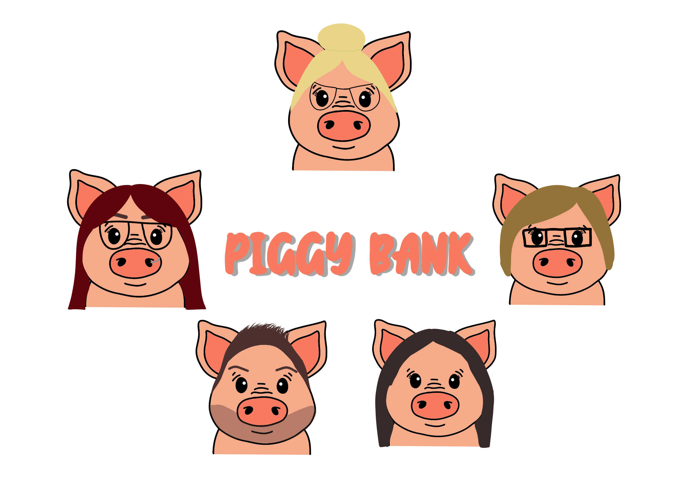

# A user-friendly Money Manager App that helps people take charge of their finances in a simple and secure way

# Piggy Bank

## Description

This project is a web application that allows users to manage their budget. It includes features such as user authentication, budget planning, and more.

## Installation

To install the project, follow these steps:

1. Clone the repository: `git clone https://github.com/Anna-Elisabeth/PiggyBankFE.git
2. Navigate to the project directory
3. Install the dependencies: `npm install`
4. Used alongside back end repo https://github.com/ZMichaelaK/PiggyBankBE.git

## Usage

To run the project, use the command: `npm start`

## Features

- User authentication: Users can create an account, log in, and log out.
- Budget planning: Users can create, view, update, and delete their budget plans.

## Technologies Used

- React.js
- Axios
- CSS

## Contributing

Contributions are welcome. Please open an issue or submit a pull request.

## License

This project is licensed under the MIT License.
